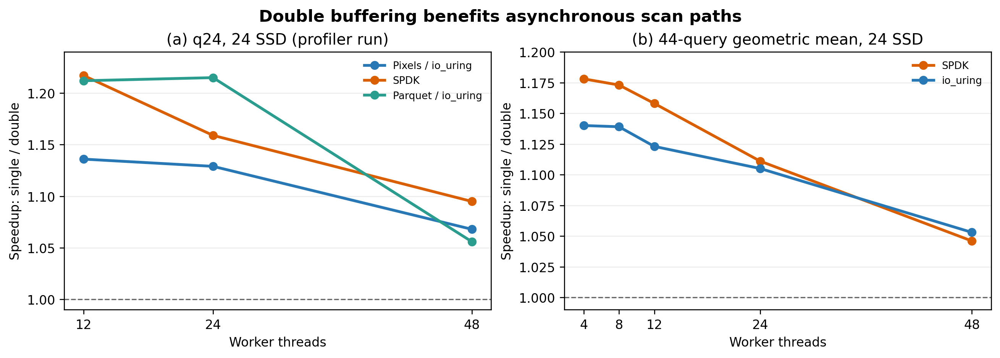
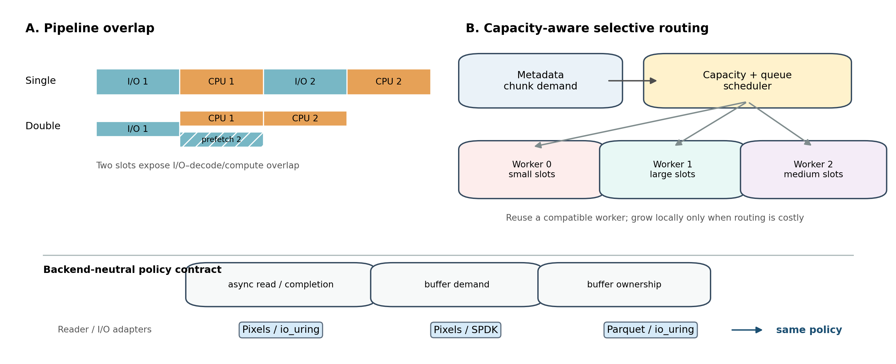
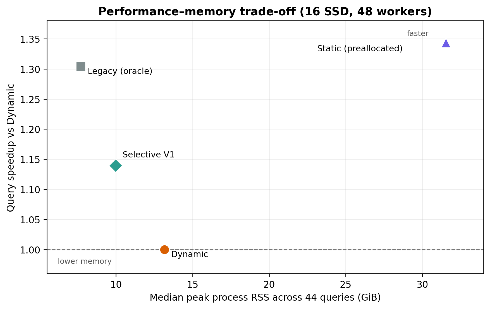

# Double Buffer 与选择性 Buffer 扩容：研究概览

日期：2026-09-14

## 一页结论

本阶段研究得到两个核心结论。

第一，**Double Buffer 的价值来自 I/O 与解码/计算的流水化重叠，而且这一机制不依赖特定异步
I/O 后端。** 归档实验在 Pixels/io_uring、SPDK 和 Parquet/io_uring 三条实现路径上均观察到
`single / double > 1`。跨 44 条查询，SPDK 和 io_uring 在全部五档线程数上都保持正收益；
q24 的 Parquet 路径也呈现相同趋势。因此，Double Buffer 应作为异步扫描路径的基础能力保留。

第二，**Double Buffer 的代价是每个 worker 同时持有 current/next 两套空间，列块尺寸差异又会
造成反复扩容或长期过量保留。** Legacy 依赖离线列大小先验，Static 在查询前完整预分配；二者
可用来建立上下界，但都不适合作为未知查询、单查询进程的真实方案。为此实现的 Selective
Dynamic 在读取 metadata 得到 column-chunk demand 后，把文件路由给已有足够容量的 worker；
只有找不到合适接收者或队列代价过高时才在本地扩容。它本质上是一个在线、容量感知的负载均衡器。

在 16 SSD、44 查询实验中，Selective V1 相对 Dynamic 的查询时间几何平均降低 **12.25%**，
跨查询峰值 RSS 中位数从 **13.16 GiB 降至 9.98 GiB（-24.1%）**。它尚未达到依赖先验信息的
Legacy，但证明了无需全局预分配，也能同时改善性能和内存。

## 1. Double Buffer：跨后端证据



图 1 左侧使用归档中的 q24、24 SSD profiler 轮次：Pixels/io_uring、SPDK、Parquet/io_uring
在 12、24、48 线程下的 `single-buffer / double-buffer` 均大于 1。右侧使用同一归档中的
44 查询结果：SPDK 的几何平均加速为 1.178×–1.046×，io_uring 为 1.140×–1.053×；高并发
下收益缩小，因为多个 worker 本身已经覆盖了部分 I/O 等待。

这组数据说明，收益来源不是某个后端的特殊实现，而是共同的异步流水线结构：处理当前数据时
预取下一份数据。同步 pread 在归档的 44 查询实验中仅为 0.994×–1.005×，也从反面说明
“多一套 Buffer”本身不会自动带来性能收益，关键是能否真正形成异步重叠。



图 2 概括了研究思路。Double Buffer 提供 current/next 两个槽位，使 I/O 与 decode/compute
重叠；选择性扩容则在这个基础上复用 worker 已经获得的容量。调度决策只需要三个抽象信息：
metadata 给出的读取需求、worker 当前容量和队列负载。io_uring、SPDK 或 Parquet reader 负责
完成异步读取与 completion，调度策略不应包含后端专有逻辑。

这里需要区分“设计边界”和“当前验证范围”：Double Buffer 已经有三条路径的数据；当前
Selective 原型仍在代码中限制为 Pixels + Dynamic + Double Buffer + io_uring，16 SSD 的性能
数据也只验证了这一路径。将同一调度接口接入 SPDK DMA pool 与 Parquet preloaded-file pool，
并重复实验，是后续证明 Selective 实现也真正跨后端所必需的工作。

## 2. 内存问题与在线方案

传统三种策略分别代表不同取舍：

| 模式 | 查询性能（相对 Dynamic） | RSS 中位数 | 所需信息与适用性 |
|---|---:|---:|---|
| Legacy | 1.304× | 7.70 GiB | 依赖离线列大小先验；理想参考线，未知数据不可直接采用 |
| Dynamic | 1.000× | 13.16 GiB | 无先验；各 worker 独立按需增长，容易重复扩容 |
| Selective V1 | **1.140×** | **9.98 GiB** | 在线 metadata + 容量/队列路由；当前可行方案 |
| Static | 1.343×（仅查询阶段） | 31.54 GiB | 查询前完整预分配；单查询进程初始化代价过高 |

表中性能是 44 个逐查询比值的等权几何平均倒数，RSS 是 44 条查询各自 3 次运行峰值的跨查询
中位数。Static 的查询阶段虽快，但包含初始化的进程时间为 Dynamic 的 4.20×，因而不能把它的
查询数字单独理解为可部署性能。



图 3 展示了核心权衡。Legacy 位于理想区域，但依赖预知列大小；Static 用约 31.5 GiB 常驻
预分配换取查询阶段速度；Dynamic 无需先验，却因各线程独立增长而增加内存和扩容开销。
Selective V1 位于 Dynamic 与 oracle 基线之间：它没有使用全局大小先验，却将已有容量当作
可复用资源，在降低内存的同时加快查询。

## 3. 实验设计与结论边界

实验由两个相互补充的部分组成：

1. **Double Buffer 后端实验（归档数据）**：24 SSD；q24 profiler 对照覆盖
   Pixels/io_uring、SPDK、Parquet/io_uring，线程数为 12/24/48；另用 44 查询、4–48 线程的
   SPDK 与 io_uring 几何平均结果检查广泛性。
2. **Buffer 分配实验（当前全量数据）**：16 SSD、48 worker、44 条 ClickBench 查询、每模式
   3 次独立运行；逐查询取中位数，再对查询比值取等权几何平均，同时记录进程峰值 RSS、perf
   与 Selective 队列指标。

归档数据每个配置只有一次测量，且 Pixels、SPDK、Parquet 的格式与 reader 不同，因此它适合
证明“异步重叠在不同后端都存在”，不适合用绝对 wall time 排名数据格式或 I/O API。当前
Selective 结果有三次重复，但仍来自单机、16 SSD 和一个查询集合；正式论文实验应随机运行顺序，
增加 3–5 次重复与置信区间，并完成 SPDK/Parquet 的 Selective 接入后再宣称端到端策略完全
后端无关。

## 4. 总结

Double Buffer 是有效的基础机制：只要后端提供真正的异步提交与完成接口，就能把下一文件读取
隐藏在当前文件的解码/计算之后；Pixels/io_uring、SPDK 和 Parquet/io_uring 的归档数据共同支持
这一点。真正的问题不是是否保留 Double Buffer，而是如何避免每个 worker 为最坏情况各自扩张
两套空间。

Selective Dynamic 给出的答案是：从 metadata 获得本次真实需求，优先把任务交给已经拥有合适
Buffer 的 worker，并用有界队列限制排队成本，最后才扩容。当前 44 查询实验显示，它相对纯
Dynamic 同时取得 **12.25% 查询时间下降和 24.1% RSS 中位数下降**。下一阶段的重点不是继续
追求更短队列，而是稳定估计“避免扩容的收益”和“排队等待的代价”，并将统一的 demand/capacity
接口接入 SPDK 与 Parquet，完成策略层面的跨后端验证。

## 数据来源与复现

- 六页汇报版：[buffer-research-overview.pptx](buffer-research-overview.pptx)
- Double Buffer 原始归档：`/tmp/pixels-rebuild-untracked-20260825.tar.gz`
- 归档 SHA-256：`61ee3a29a52a216d2b4ef260c2781305b08a5728d2bd44abcf1ee51c15db2703`
- 归档成员：`testcase/performance-test/comparison_spdk_20260715_vs_iouring_20260716/EXPERIMENT_REPORT.md`
- Buffer Pool 全量分析：[Selective Growth V2 报告](selective-growth-v2-16ssd-results.md)
- 图表脚本：[`build_buffer_research_overview.py`](../../testcase/buffer-pool/build_buffer_research_overview.py)
- 图 1 的归档派生数据：[`doublebuffer-archive-evidence.csv`](figures/buffer-research-overview/doublebuffer-archive-evidence.csv)

复现图表：

```bash
python3 testcase/buffer-pool/build_buffer_research_overview.py \
  --archive /tmp/pixels-rebuild-untracked-20260825.tar.gz

python3 testcase/buffer-pool/build_buffer_research_slides.py
```
