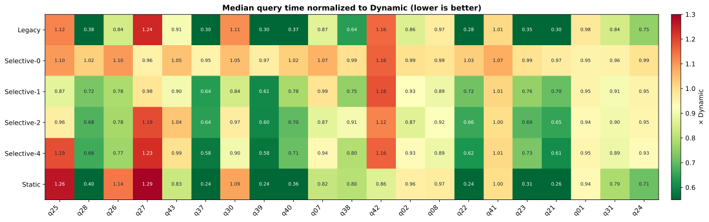
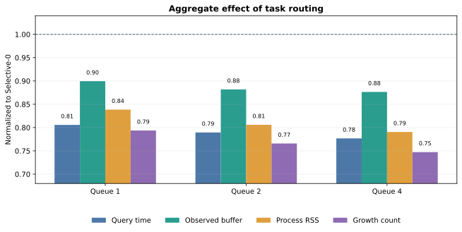
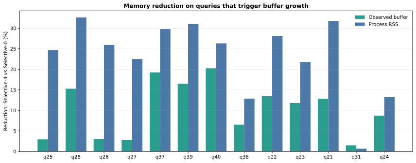
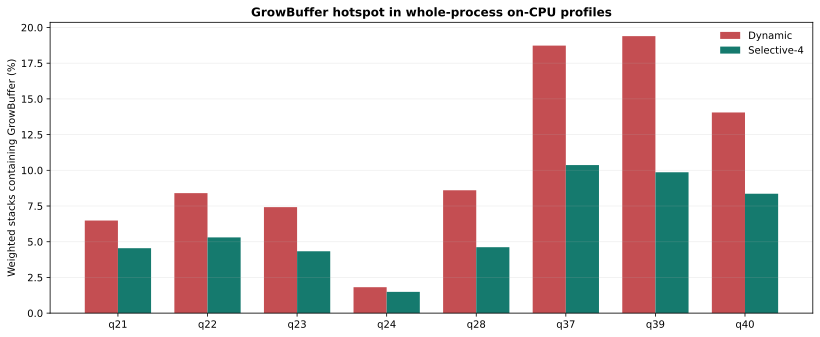

# 选择性扩容 V1：16 SSD 完整实验报告

日期：2026-09-10
实验版本：Dynamic double buffer selective-growth V1
设计文档：[selective-growth-v1-design.md](selective-growth-v1-design.md)

## 结论摘要

完整矩阵成功执行，选择性扩容已经证明能够同时降低 Dynamic 的扩容次数、已注册 buffer
容量、进程 RSS 和严重退化查询的耗时，但尚未追回 Legacy/Static 的全部性能差距。

- 21 查询中，`selective-1` 相对 Dynamic 有 17 个查询提升、3 个基本持平、1 个回退；
  几何平均耗时下降 16.0%，21 个查询中位数之和从 156.41 秒降至 125.71 秒。
- `selective-4` 的总耗时最低，为 121.19 秒，比 Dynamic 下降 22.5%；但 q25、q27、q42
  分别回退 18.9%、22.8%、16.4%，不适合作为当前默认值。
- 以 `selective-0` 为消融基线，`selective-4` 将扩容次数降低 25.3%、增长字节降低 17.5%、
  观察到的 buffer 容量合计降低 12.4%、RSS 合计降低 20.9%。任务路由确实改变了扩容行为。
- q37、q39 的效果最好：相对 Dynamic 分别加速 41.9% 和 42.4%；对应火焰图中
  GrowBuffer 加权栈占比分别从 18.7% 降至 10.4%、从 19.4% 降至 9.9%。
- q24 的绝对内存仍然最大。`selective-4` 相对 `selective-0` 将进程 RSS 从 43.02 GiB
  降到 37.33 GiB，但查询时间只比 Dynamic 改善 6.8%，说明 q24 还有明显的非扩容瓶颈。
- Static 总时间最快，但跨查询 RSS 中位数为 30.78 GiB；选择性方案的对应值为
  1.74–1.82 GiB。Static 仍是以大规模预分配换取查询性能的上界，不是内存可比基线。

当前建议是：**保留功能默认关闭；后续实验默认从 queue=1 开始，不直接采用 queue=4。**
在生产启用前，应先消除无增长查询上的无效转移，并补充队列等待时间与负载不均衡统计。

## 实验完整性

实验从 2026-09-09 22:22:23 运行到 2026-09-10 00:36:03，共 2.23 小时。

| 项目 | 实际值 |
|---|---:|
| SSD 路径 | 16 |
| 每个路径文件数 | 640 |
| 总文件数 | 10,240 |
| DuckDB/Pixels 线程数 | 48 |
| 查询数 | 21 |
| 模式数 | 7 |
| 每组普通重复 | 3 |
| 普通计时/RSS 记录 | 441 |
| perf stat | 147 |
| perf record / 火焰图 | 147 / 147 |
| 空 folded stack | 0 |
| 运行错误 | 0 |
| SUCCESS 标记 | 存在 |

七种模式为 Legacy、Dynamic、selective-0、selective-1、selective-2、selective-4、Static。
每个 query/mode 的 perf stat 和 perf record 各额外运行一次，不与三次普通计时复用进程。
普通模式顺序使用固定种子随机化；没有显式清除系统缓存，因此本报告描述的是“混合缓存状态”结果。

原始结果目录名中包含一个实际换行符：

```text
testcase/buffer-pool/results/selective-v1-16ssd-\n    full-20260909-222223
```

这来自执行命令中的输出变量换行，不影响本次数据内容，但后续运行应使用单行绝对路径。
清洗后的逐查询数据位于
[per-query.csv](figures/selective-v1-16ssd-results/per-query.csv)，分析元数据位于
[analysis-metadata.json](figures/selective-v1-16ssd-results/analysis-metadata.json)。

## 整体性能与内存

下表中的“总时间”是 21 个查询各自三次中位数之和，不是一次连续 workload 的墙钟时间；
“RSS 中位数”是 21 个查询的进程峰值 RSS 中位数；“峰值 RSS”是所有查询中最大的中位数。
提升/持平/回退按相对 Dynamic 的 ±3% 划分。

| 模式 | 总时间（s） | 几何均值 / Dynamic | RSS 中位数（GiB） | 峰值 RSS（GiB） | 提升/持平/回退 |
|---|---:|---:|---:|---:|---:|
| Legacy | 85.31 | 0.656 | 1.47 | 31.48 | 14 / 3 / 4 |
| Dynamic | 156.41 | 1.000 | 2.24 | 41.22 | 0 / 21 / 0 |
| Selective-0 | 156.03 | 1.016 | 2.25 | 43.02 | 6 / 8 / 7 |
| Selective-1 | 125.71 | 0.840 | 1.82 | 39.06 | 17 / 3 / 1 |
| Selective-2 | 123.18 | 0.842 | 1.74 | 37.88 | 17 / 1 / 3 |
| Selective-4 | **121.19** | **0.839** | **1.74** | **37.33** | 16 / 2 / 3 |
| Static | 82.38 | 0.636 | 30.78 | 43.88 | 15 / 2 / 4 |



**图 1.** 每格为该模式查询时间中位数除以 Dynamic；绿色越深表示越快。选择性方案的收益
集中在 q21、q22、q23、q28、q37、q39、q40 等原 Dynamic 严重退化查询。红色的 q25、
q27、q42 展示了较深队列的风险。

`selective-0` 与 Dynamic 总时间接近，说明 metadata demand、容量快照和查询级锁本身的
总开销有限。不过其几何平均慢 1.6%，且有 7 个查询超过 3% 回退；三次重复对短查询仍有
较大抖动，所以它只能说明“没有普遍的大退化”，不能证明准备路径完全免费。

## 任务转移是否真正减少扩容

下表全部以 `selective-0` 为基线。“RSS 合计”和“buffer 合计”是逐查询中位数求和，只用于
比较整个查询集合，不代表多个查询同时运行时的内存峰值。转移数为各查询三次运行中位数之和。

| 模式 | 转移文件数 | 总时间变化 | RSS 合计变化 | buffer 合计变化 | 扩容次数变化 | 增长字节变化 |
|---|---:|---:|---:|---:|---:|---:|
| Selective-1 | 11,394 | -19.4% | -16.2% | -10.0% | -20.6% | -14.2% |
| Selective-2 | 13,664 | -21.1% | -19.4% | -11.8% | -23.4% | -16.6% |
| Selective-4 | 14,892 | **-22.3%** | **-20.9%** | **-12.4%** | **-25.3%** | **-17.5%** |



**图 2.** 相对 selective-0 的归一化结果。队列加深带来持续收益，但从 queue=2 到 queue=4
的边际收益已经较小。纵轴从 0.68 起，柱高用于比较变化比例，不表示绝对量。

这组数据支持原始假设：让一部分文件复用少数 worker 已经增长过的 buffer，可以避免更多
worker 重复扩容。它不仅减少内部统计的 buffer 容量，也同步降低整进程 RSS，因此不是单纯
改变统计口径。不过 RSS 下降幅度大于 buffer 容量下降幅度，说明减少扩容还降低了临时新旧
buffer 共存、页提交或 allocator 保留等未计入 `observed_buffer_bytes` 的内存成本。



**图 3.** queue=4 相对 queue=0 的逐查询内存下降。q28、q37、q39、q21 的 RSS 降幅约
30% 或更高；q31 几乎不受影响，因为它的大部分 RSS 来自查询执行结构，而非 Dynamic buffer。

## 严重退化查询

| 查询 | Dynamic（s） | Selective-1（s） | Selective-4（s） | S4 相对 Dynamic | Legacy（s） | RSS S0 → S4（GiB） |
|---|---:|---:|---:|---:|---:|---:|
| q21 | 12.33 | 8.69 | 7.51 | -39.1% | 3.66 | 15.40 → 10.52 |
| q22 | 11.33 | 8.11 | 7.08 | -37.5% | 3.16 | 14.46 → 10.40 |
| q23 | 15.30 | 11.58 | 11.13 | -27.3% | 5.40 | 20.30 → 15.88 |
| q28 | 11.95 | 8.64 | 7.91 | -33.8% | 4.53 | 14.32 → 9.65 |
| q37 | 11.60 | 7.38 | 6.74 | -41.9% | 3.44 | 14.92 → 10.47 |
| q39 | 11.18 | 6.77 | 6.44 | -42.4% | 3.39 | 12.97 → 8.95 |
| q40 | 13.07 | 10.18 | 9.25 | -29.2% | 4.81 | 20.43 → 15.05 |
| q24 | 40.10 | 38.24 | 37.38 | -6.8% | 30.24 | 43.02 → 37.33 |

除 q24 外，扩容热点较重的查询都获得了明显加速；但 Selective-4 仍然比 Legacy 慢：
q21/q22/q23/q28/q37/q39/q40 分别约为 Legacy 的 2.05、2.24、2.06、1.75、1.96、1.90、
1.92 倍。因此“重复扩容”是 Dynamic 回退的重要组成部分，却不是唯一原因。

q24 每次查询处理的列多、执行时间长，虽然转移文件中位数达到 2,333、扩容次数从 6,749
降到 5,888，性能只改善 6.8%。其 GrowBuffer 火焰图占比原本只有 1.8%，远低于 q37/q39，
所以减少扩容只能取得有限收益。这与此前“q24 字符串列很多，但相对回退没有最严重”的观察一致。

## 回退查询与 queue=1 推荐

| 查询 | Dynamic（s） | Selective-1（s） | Selective-4（s） | S4 回退 | 扩容 S0 → S4 | RSS S0 → S4（GiB） |
|---|---:|---:|---:|---:|---:|---:|
| q25 | 2.28 | 1.99 | 2.71 | +18.9% | 472 → 289 | 2.25 → 1.70 |
| q27 | 2.54 | 2.50 | 3.12 | +22.8% | 449 → 316 | 2.25 → 1.74 |
| q42 | 1.22 | 1.44 | 1.42 | +16.4% | 0 → 0 | 1.19 → 1.19 |

q25、q27 表明“内存更少”不自动等于“查询更快”：深队列继续减少扩容和 RSS，但可能造成
工作分配不均、队列等待或存储局部性损失。当前没有记录 queue wait time，尚不能在三者之间
做因果区分。q25 使用 queue=1 反而比 Dynamic 快 12.7%，q27 使用 queue=1 基本持平，
所以 queue=1 是更安全的固定阈值。

q42 更关键：四个 selective 模式的扩容次数都是 0，但 queue=1/2/4 仍各转移约 74 个文件，
并产生 12%–18% 回退。q01、q02、q07、q08、q30、q41、q42、q43 也具有“发生转移但
没有 GrowBuffer”的共同特征；这些任务转移没有减少最终初始分配数量，是纯调度成本的重要来源。

下一版应增加 **growth-pressure gate**：只有当前列已有 buffer 且确实需要增长，或预计可避免的
增长字节超过阈值时才允许转移；首次创建 buffer 和查询尚未出现真实扩容压力时留在本地。
这有望保留 q21/q37/q39 的收益，同时消除 q42 一类无效转移。

## perf stat 与火焰图

perf stat 是每个 query/mode 一次独立整进程运行。下表为 21 个查询相对 Dynamic 的几何均值；
它包含进程和 buffer 初始化，不能解释为纯 SQL 执行阶段硬件计数。

| 模式 | task-clock | cycles | instructions | page faults | context switches | IPC 中位数 |
|---|---:|---:|---:|---:|---:|---:|
| Legacy | 0.926 | 1.055 | 0.989 | 2.031 | 1.010 | 1.663 |
| Dynamic | 1.000 | 1.000 | 1.000 | 1.000 | 1.000 | 1.829 |
| Selective-0 | 1.000 | 1.013 | 1.002 | 0.989 | 1.067 | 1.830 |
| Selective-1 | 0.935 | 1.008 | 0.995 | 1.014 | 1.114 | 1.854 |
| Selective-2 | 0.944 | 1.010 | 0.996 | 1.019 | 1.148 | 1.843 |
| Selective-4 | 0.911 | 1.009 | 0.994 | 1.016 | 1.104 | 1.840 |
| Static | 1.237 | 1.533 | 1.205 | 28.356 | 0.969 | 1.450 |

Selective 的 instructions 基本不变，context switches 增加约 10%–15%；这符合增加任务交接
但减少扩容阻塞的实现。Static 的整进程 page faults 达 Dynamic 的 28.4 倍，与大规模预分配
和首次触页一致。cycles 与查询时间并不同比变化，进一步说明整进程 perf 与 EXPLAIN ANALYZE
计时边界不同，不能用单个计数器代替查询时间结论。



**图 4.** 统计 folded stack 中包含 `DynamicBufferPool::GrowBuffer` 的加权占比，属于包含式
热点而非函数 self time。q37 从 18.7% 降到 10.4%，q39 从 19.4% 降到 9.9%，与扩容次数
和查询时间的下降方向一致。

代表性原始火焰图：

- [q37 Dynamic](figures/selective-v1-16ssd-results/q37-dynamic-flamegraph.svg)
- [q37 Selective-4](figures/selective-v1-16ssd-results/q37-selective-4-flamegraph.svg)

需要强调：147 份火焰图中，包含 `[unknown]` 的加权栈比例中位数为 88.8%（范围
50.9%–97.3%）。因此已解析的 GrowBuffer 趋势可以作为支持证据，但不能认为当前火焰图完整
覆盖了 CPU 时间。后续应改善符号解析和栈回溯，再对其他未知热点做结论。

## 各 Buffer 模式的适用条件与改进方向

上述改进的 V2 配置、指标格式、可视化和 44 查询全量测试命令见
[Selective Growth V2 与 Static 无锁查询：设计及全量测试说明](selective-growth-v2-optimization-and-test.md)。

本次实验中的七个配置可以归纳为四类策略：Legacy、Dynamic、Selective Dynamic 和
Static。其中 `selective-0` 是启用 metadata demand 与选择性调度框架、但禁止任务转移的
消融基线；`selective-1/2/4` 分别表示接收线程的队列长度上限，不是三种独立的 Buffer
实现。

没有一种模式在所有查询上都最优。模式是否有效主要取决于四个条件：查询投影列数、不同
文件之间 ColumnChunk 大小的波动、扩容是否落在关键路径，以及任务转移后是否仍然保持负载
与存储局部性。

| 工作负载条件 | 首选模式 | 原因 |
|---|---|---|
| 内存充足，追求稳定查询路径 | Static | 查询期间没有分配、扩容和注册更新 |
| 当前实现下兼顾性能与内存 | Legacy | 性能接近 Static，只为实际查询列和工作线程分配 |
| 窄查询且 chunk 大小稳定 | Dynamic | 按实际需求分配，通常没有或只有少量扩容 |
| 文件间 chunk 波动大，多个线程重复扩容 | Selective-1/2 | 复用已经增长的 worker buffer，风险低于深队列 |
| 扩容压力很高且任务分布均匀 | Selective-4 | 本轮总体收益最大，但必须防止负载倾斜 |
| 没有扩容的短查询 | Dynamic，关闭任务转移 | 转移无法节省内存，只会增加调度成本 |
| 单独执行查询，且允许提前扫描全部 metadata | 查询级 Static 或预规划 Dynamic | 可以在执行前一次性得到本查询所需容量 |

### Legacy

Legacy 在每个实际扫描线程首次使用时，为当前查询读取的列建立两套注册 Buffer。它适合投影
列相对固定、column-size CSV 能覆盖最大 ColumnChunk，且希望以远低于全局 Static 的内存取得
接近 Static 性能的场景。本轮 Legacy 的总时间为 85.31 秒，只比 Static 的 82.38 秒慢约
3.6%；跨查询 RSS 中位数为 1.47 GiB，而 Static 为 30.78 GiB，因此它是当前版本最强的
性能/内存基线。

当前实现需要改进以下方面：

1. **统一容量不足语义。** 当前 `BufferPool::Initialize()` 发现后续需求超过已有容量时直接
   抛出异常，并没有 `GrowBuffer()`。旧版报告中的 Legacy 自动扩容或 `AddNewBuffer()` 统计
   不能直接用于解释当前分支；代码、指标和文档必须使用同一实现口径。
2. **明确跨查询生命周期。** Buffer、ring 和注册状态是线程局部的，需要明确 DuckDB 工作线程
   跨查询复用时，列集合变化、Buffer 释放和 io_uring 注销的行为。
3. **复用安全的注册状态。** 相同投影的重复查询可以复用线程级 Buffer/ring，避免每个进程或
   查询重新分配、清零和注册；不同投影必须重新验证列到注册槽位的映射。
4. **补齐统计。** 分别记录初始分配容量、实际触页容量、注册 Buffer 数量、查询结束保留容量和
   容量不足次数，避免把 RSS、逻辑容量和进程生命周期累计量混为一个峰值。

### Dynamic

Dynamic 只为实际读取的列按当前文件需求分配 Buffer，适合窄查询、ColumnChunk 大小稳定、
大部分线程只需要初次分配的情况。如果查询的主要成本是计算，少量扩容还可能被其他线程的
扫描和计算掩盖。

本轮有三条查询的 Dynamic 三次中位数同时小于 Legacy 和 Static：

| 查询 | Legacy（s） | Dynamic（s） | Static（s） | Dynamic 相对 Legacy | Dynamic 相对 Static |
|---|---:|---:|---:|---:|---:|
| q25 | 2.56 | **2.28** | 2.88 | -10.9% | -20.8% |
| q27 | 3.14 | **2.54** | 3.28 | -19.1% | -22.6% |
| q30 | 1.69 | **1.52** | 1.65 | -10.1% | -7.9% |

q30 只扫描 `ResolutionWidth` 一列。以 selective-0 作为相同 Dynamic Buffer 算法的统计代理，
它发生 96 次初始分配，即 48 线程 × 两套 Buffer × 一列，扩容次数和增长字节均为 0。这是
Dynamic 最理想的工作负载。q25/q27 分别发生 472/449 次中位数扩容，但采样栈中
`GrowBuffer()` 只占约 1.7%/1.9%；它们的字符串过滤与 Top-N 排序成本较高，扩容没有成为
主要关键路径。这说明扩容次数不能单独预测性能，还必须测量扩容等待时间与关键路径占比。

三条查询的样本仍然不足以证明稳定加速。q30 三种模式的三次范围高度重叠；q25 的 Dynamic
和 Legacy 范围也有重叠；q27 Static 的三次结果呈现一次约 2.39 秒、两次约 3.29 秒的双峰。
“Dynamic 可以更快”是成立的，但具体查询的稳定收益需要增加到 10–20 次 query-only 重复。

Dynamic 的改进方向如下：

1. **metadata 辅助首次定容。** 读取 footer 后，以当前文件需求或带余量的需求作为第一次分配
   容量，避免从很小的首个 chunk 开始连续增长。
2. **采用几何增长或 size class。** 使用 `max(required, old_capacity × 1.5)` 或离散容量等级，
   避免每次精确增长到当前需求而产生多次小幅扩容。
3. **验证并取消无效复制。** `GrowBuffer()` 当前会分配新 Buffer、复制旧内容并更新注册。
   如果旧文件 I/O 已完成且旧内容不会再被消费，应直接替换 Buffer；必须先证明两套 Buffer
   没有 outstanding I/O，不能仅为性能删除同步保护。
4. **减少注册更新。** 统计 `io_uring_register_buffers_update()` 的次数和耗时，评估批量更新
   多个槽位或在已注册的 size-class Buffer 之间交换所有权。
5. **拆分增长成本。** 新增 `growth_wait_ns`、`growth_alloc_ns`、`growth_copy_ns`、
   `registration_update_ns` 和 `growth_on_critical_path`，区分“扩容很多”和“扩容真正拖慢查询”。

### Selective Dynamic

Selective Dynamic 适合大量文件、同一列 chunk 尺寸变化明显，且不同 worker 会重复扩容到相近
容量的查询。它把本地 Buffer 不足的文件交给已经具有足够容量的同 storage group worker，
以少量任务交接换取更少的分配、复制和注册更新。本轮 selective-4 相对 selective-0 将扩容
次数降低 25.3%、增长字节降低 17.5%、Buffer 容量合计降低 12.4%、RSS 合计降低 20.9%，
证明这种复用在 q21/q22/q23/q28/q37/q39/q40 等高增长压力查询上有效。

它不适合没有扩容、文件很少、计算占主导，或者任务转移会破坏线程/SSD/NUMA 局部性的查询。
q42 在所有 Selective 配置中都没有扩容，却仍转移约 74 个文件并回退 12%–18%，是当前策略
缺少收益判断的直接反例。q25/q27 则说明队列加深虽然继续减少容量，却可能因为负载不均、
等待或局部性损失而变慢。

Selective Dynamic 的改进方向如下：

1. **增加 growth-pressure gate。** 只有 `required > local_capacity`，并且预计本地扩容成本大于
   排队与转移成本时才允许转移。当前 Buffer 已足够时必须留在本地，优先消除 q42 式无效交接。
2. **使用成本模型选择接收者。** 目标评分同时考虑可用容量、队列长度、当前工作量、storage
   group、NUMA node 和预计排队时间，而不是只判断“容量足够”。
3. **自适应队列长度。** 无增长压力时使用 queue=0；出现少量重复扩容后升至 1；持续高压力时
   再升至 2 或 4。当前不建议继续固定增加到 8 或 16。
4. **补充队列指标。** 增加 `queue_wait_ns`、`queue_residence_ns`、每 worker 文件数/字节数、
   receiver busy time、转移拒绝原因和跨 NUMA 转移数，直接验证 q25/q27 的退化原因。
5. **传递已解析 metadata。** 发送者已经读取 footer 和 demand，转移时应把这些结果一并交给
   接收者，避免重新构造 metadata-only reader；仍需保证共享 footer 的 backing memory 生命周期。
6. **保持至多一次转移。** 禁止接收者再次转发同一文件，避免形成循环、饥饿和不可预测的等待。

固定队列下，queue=1 是当前最稳健的候选；queue=2 的总体性能/内存折中较好；queue=4 总体
时间最低但尾部风险更大。最终目标应是根据真实扩容压力在 0/1/2/4 之间动态切换。

### Static

Static 在扩展加载时按“全部列 × 最大线程数 × 两套 Buffer”一次性分配、首次触页并注册，适合
内存充足、schema 和最大 chunk 可预知、进程长期运行且更关注稳定延迟的场景。它在查询期间
没有分配、扩容和注册更新，是合适的性能上界，但不是与按需方案内存对等的基线。

当前 Static 仍有以下改进空间：

1. **移除查询热路径全局锁。** `GlobalStaticBufferPool::GetBuffer()` 每次访问都获取同一个
   `poolMutex_`，虽然初始化后 Buffer 表只读，而且每个 threadId 实际使用不同 Buffer。应冻结
   初始化后的容器，并改成 `buffers[threadId][columnId][bufferIdx]` 的无锁整数索引，避免全局
   mutex 和字符串 `std::map` 查找。
2. **真正使用线程数配置。** 当前扩展加载路径仍将 `maxThreads` 硬编码为 48，没有使用测试脚本
   设置的 `pixel.static.buffer.threads`。应读取配置并验证 DuckDB 实际扫描线程数不超过容量。
3. **NUMA 本地首次触页。** 当前初始化线程对全部 Buffer 执行 `memset`，可能把页面集中放到
   单个 NUMA node。应由对应 worker 对自己的 Buffer 首次触页，并增加 NUMA hit/miss 指标验证。
4. **实现查询级 Static。** 对“单独执行一个查询”的场景，先扫描全部文件 metadata，再只按
   “查询投影列 × 实际线程 × 两套 Buffer”一次性分配每列最大需求，从而同时消除运行期扩容和
   全表预分配浪费。
5. **分离初始化与查询统计。** 当前整进程 perf 包含 Static 预分配和预触页，因此约 795 万次
   page fault 不能解释成 SQL 查询阶段缺页。后续必须分别统计 extension init、buffer init、
   query execution 和 process total。

Static 当前的全局所有权不等于多个线程共享同一块读写内存。其 Buffer 由进程级 singleton
集中持有，但按 `threadId × column × bufferIdx` 分区，每个线程正常情况下独占自己的两套
Buffer。性能问题来自全局索引和锁，而不是两个线程同时写入同一块 Buffer。

### Double Buffer 的适用边界

上述模式都启用了 double buffer。它只有在“当前文件解码”和“下一文件 I/O”能够重叠时才产生
收益，同时会把内容 Buffer 容量放大约两倍。文件很少、解码无法覆盖 I/O、预取经常来不及完成，
或者内存压力很高时，第二套 Buffer 可能只有成本而没有收益。

后续应记录 `prefetch_submitted`、`prefetch_completed_before_use`、`prefetch_wait_ns`、两套
Buffer 的实际使用字节以及 I/O/CPU overlap ratio。若某查询的第二套 Buffer 长期没有产生有效
重叠，可以在查询级降为单 Buffer，而不是全局固定启用 double buffer。

### 推荐的长期形态

长期方案不应在纯 Static 和纯 Dynamic 之间二选一，而应组合 metadata 预规划、按需增长和
选择性复用：

```text
查询开始
  → 扫描全部文件 metadata
  → 计算每列最大值、分位数和总内存预算
  → 高频且稳定的列：查询级一次性预分配
  → 尺寸波动的列：Dynamic size class / 几何增长
  → 多线程重复大块需求：Selective worker 复用
  → 预取重叠收益低的列或查询：降为单 Buffer
```

该混合模式以查询级 Static 消除可预测的运行期成本，以 Dynamic 控制异常大 chunk 的内存，
再用 Selective 避免不同 worker 对异常容量重复扩容，最符合“降低总内存但不损害单查询性能”
的目标。

## 决策与后续工作

1. 保持 `pixels.dynamic.selective.enabled=false`，当前结果支持继续实验，不支持直接生产默认开启。
2. 统一 query-only 计时和 Buffer 指标口径，区分逻辑容量、实际驻留、初始化、扩容复制与注册
   更新时间；Legacy 当前不支持自动增长，不能继续沿用旧版增长统计解释本分支。
3. 移除 Static 查询期 `poolMutex_` 和字符串查找，读取配置线程数，并实现 worker NUMA 本地
   首次触页；这些改动完成后重新建立 Static 性能上界。
4. Dynamic 使用 metadata 辅助首次定容和几何增长，验证取消旧 Buffer 数据复制的正确性，
   并分别测量分配、复制和注册更新时间。
5. 实现 growth-pressure gate，首先消除 q42 等无 GrowBuffer 查询的文件转移；下一轮以
   queue=1 为固定默认候选，queue=2/4 只作为高扩容压力下的自适应选项。
6. 增加 `queue_wait_ns`、接收者执行时间、每 worker 文件数、队列驻留峰值、storage group 和
   NUMA 分布统计，用数据解释 q25/q27 的深队列回退。
7. 修复或验证 `storage.directory.depth=1` 对 `/data/9a3-*` 的实际分组。目前“同 storage group”
   不等于已经证明“同物理 SSD”，可能影响局部性解释。
8. 增加 double-buffer overlap 指标；对于没有有效预取重叠的查询，评估查询级单 Buffer。
9. 改善 perf 符号质量；当前 88.8% unknown 使火焰图无法排除 Dynamic 剩余差距中的其他热点。
10. 完成上述关键修正后先重跑重点集合：q21/q22/q23/q28/q37/q39/q40（收益组）、
    q25/q27/q42（风险组）、q24（高内存但低 GrowBuffer 占比组）、q30（零增长对照组），
    无需立即重跑全部 735 个进程。

综合判断：**选择性复用方向成立，queue=1 已具备较好的性能/风险平衡；下一阶段的重点不是继续
增加队列深度，而是减少无效转移、解释负载不均，并查明仍然比 Legacy 慢约 28% 几何平均的剩余成本。**

## 复现分析

图表和清洗 CSV 可由以下命令重新生成：

```bash
MPLCONFIGDIR=/tmp/pixels-matplotlib \
python3 testcase/buffer-pool/analyze_selective_results.py \
  --output docs/buffer-pool/figures/selective-v1-16ssd-results
```

脚本会自动选择最新的、带 SUCCESS 的完整 16 SSD × 21 查询结果；也可以使用
`--results '<path>'` 显式指定目录。
