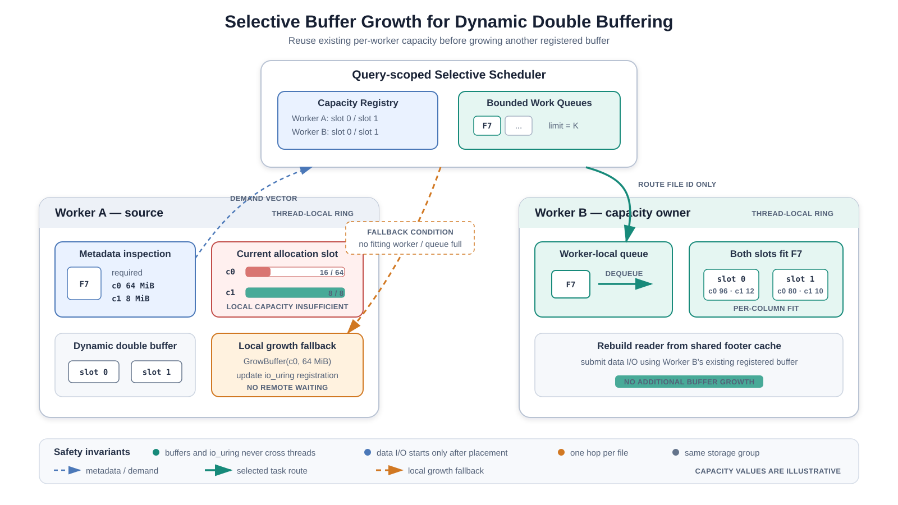

# 选择性扩容 V1 设计

日期：2026-09-09。状态：默认关闭的实验实现，尚不能宣称查询性能不退化。

完整 16 SSD × 21 查询 × 7 模式的实测结论见
[16 SSD 完整实验报告](selective-growth-v1-16ssd-results.md)。

后续 growth-pressure gate、接收者成本模型、自适应队列、队列时间序列指标、Static 无锁查询
以及 44 查询 × 16 SSD 测试说明见
[selective-growth-v2-optimization-and-test.md](selective-growth-v2-optimization-and-test.md)。

## 目标与范围

针对单独执行一个查询的 Dynamic + double buffer 模式，让需要较大 column chunk
的文件尽量复用少数 worker 已有的大 buffer，减少所有 worker 都扩到高水位的情况。
没有合适接收者或队列满时，仍由源线程按原 Dynamic 路径扩容，不等待其他线程。

V1 明确限制：io_uring、非 GlobalByteBufferPool、非 GlobalStaticBufferPool、非
fixedSize；每个文件恰好一个目标 row group。多 row group 文件直接报错。
这是可测试的窄范围原型，不是完整通用调度器，也不设置硬内存预算。

## 调度规则

### 方案示意图



**图 1. 选择性扩容架构。** Worker A 从文件 metadata 得到逐列 buffer 需求。本地容量
不足时，查询级调度器可以只把文件 ID 发送给同 storage group、两套 buffer 均满足需求的
Worker B；reader、buffer 和 io_uring 不跨线程。找不到候选者或队列已满时，Worker A
立即通过原 Dynamic 路径扩容。图中容量仅用于解释判定方式，并非某条查询的实测值。

图中的容量判断是“逐列、逐槽”判断，不会将不同列或两套槽的容量相加。跨线程传递的
只有文件 ID；reader、buffer 指针和 io_uring ring 始终留在所属线程。任何无法安全转移
的情况都会落到本地扩容路径，不等待其他 worker 释放资源。

1. worker 优先从自己的接收队列取任务，否则领取所属 storage group 的未分配文件。
2. 构建 reader，读取 metadata；还未分配 chunk buffer，也未提交 chunk 数据 I/O。
3. 计算每个实际读取列的需求；当前分配槽逐列满足则本地执行。
4. 否则在同 storage group 的接收者中查找：仍接受任务、队列未满、**两套 buffer
   各自都逐列满足需求**。选队列最短者，同长度按注册顺序。
5. 若找到，则入队文件 ID，关闭源线程 metadata-only reader，源线程继续领取其他文件。
   目标重建自己的 reader，通过共享 footer cache 复用有所有权保护的 metadata。
6. 无接收者则本地扩容；一个任务最多转移一次，每次填充预取位置最多连续转移两个任务。

需求使用与 Dynamic `read()` 一致的 Direct I/O 公式：

```text
need[column] = blockEnd(chunkOffset + chunkLength) - blockStart(chunkOffset)
```

不使用总容量判定，不把不同列、不同槽的容量相加。以实际 targetColumns 为准，
不只看 SQL 输出列。文件 ID 与原 storage group 保持不变，因此 batch ID 不随接收者改变。

## 为什么暂时要求两套槽都满足

当前 DynamicBufferPool 的 `currBufferIdx` 实际是当前分配/提交使用的槽；scanner
按文件边界 Switch。V1 保留此顺序。目标队列等待多久、期间经历几次 Switch 不确定，
要求两套槽都满足，可以避免把任务排到错误的槽，也不需要改动解码侧生命周期。

代价是只有一套大 buffer 的 worker 不能接收任务，可能错过显著节省机会。这是相对于
原始方案的保守收窄，不应把测试结果外推到“任意一套槽够大即可接收”的完整实现。
后续若放开，需要显式槽绑定和 Loading/Ready/Decoding/Reusable 状态管理。

## 所有权、并发与退出

- Scheduler 放在 query global state，所有调用持有现有 scan-global lock。
- 共享的是两套逐列容量的数值副本；指针、reader、buffer、ring 不跨线程。
- metadata 读取、reader 构建、实际 buffer 分配和数据 I/O 都在调度锁外。
- 容量在成功执行 read 后发布；正常扫描过程中只增不减，排队任务的容量承诺不会失效。
- claim 在同一把锁内检查队列和未分配文件；均无工作时立即停止接受转移。
  源线程若遇到已退休目标，会本地扩容，不会把任务交给已经退出的 worker。
- 已领取但仍在读 metadata 的文件由源线程持有；找不到接收者时源线程必须完成。
  因此不依赖等待中的空闲 worker，也不新增阻塞 DuckDB worker 的条件变量。
- 退休不等于完成：worker 可能仍在解码最后一个文件；只有扫描结束后才标记 finished。
  DuckDB 在同一 OS 线程上重新创建 local state 时，仅允许复用 finished 的注册记录。
- worker 跨 OS 线程恢复或同时存在两个共用 TLS pool 的活跃 local state 时失败退出，
  不把不安全情况静默当作普通 Dynamic 执行。
- 取消/异常由原查询错误传播和 reader 销毁路径处理；队列不持有 buffer 或文件句柄。
  查询取消时，统计中 transferred 与 dequeued 不保证相等。

V1 的可终止性不依赖原 `active_threads` 数是否等于实际创建 local state 数。
最终调度统计在 global state 销毁时打印，不依赖原有 profiler 最后线程判定。

## 实现位置

- `pixels-common/include/physical/SelectiveBufferScheduler.h`：容量判定、队列、领取/退休、统计。
- `DynamicBufferPool.{h,cpp}`：只读 owner-thread 容量快照；不改扩容策略。
- `PixelsRecordReaderImpl::prepareBufferDemand()`：metadata-only 的需求计算入口。
- `PixelsScanFunction.cpp`：默认关闭配置、队列领取、提交前转移、容量发布。
- `PixelsReadGlobalState.hpp` / `PixelsReadLocalState.hpp`：查询级和 worker 级状态。

同时修复了 `prepareRead()` 在部分 row group footer 命中缓存时，用 `i` 而不是
`fis[i]` 判断 miss 的索引问题。转移会复用共享 footer cache，不能假设全命中或全未命中。

真实转移测试还暴露并修复了 metadata 所有权问题：`DirectRandomAccessFile::readFully`
返回的 ByteBuffer 是非 owning slice；旧 cache 虽保存 slice 的 shared_ptr，却没有
保住底层 directBuffer。现在通过 `retainViewOwner()` 的 aliasing shared_ptr 同时保留
view 和 backing allocation，源 reader 关闭后缓存仍有效，不复制 metadata 内容。
这个修复同样适用于普通 Dynamic/Legacy 的共享 metadata cache。

## 配置和测量

```properties
pixels.dynamic.selective.enabled=false
pixels.dynamic.selective.queue.limit=1
```

启用时 queue.limit 接受 0..64，缺省 1。0 仍执行 metadata demand 和统计路径，
但禁止转移，是隔离调度准备开销的消融基线；不是关闭整个实验功能。

日志字段：claimed 为从文件源领取数量；transferred/dequeued 为入队/出队数量；
local_fit/local_grow 为文件级决策数；queue_high_water 是任一 worker 的最大待处理队列长度。
allocations/growths 根据成功提交前后容量快照统计列槽的新建/增长次数；growth_bytes
仅统计已有槽净增字节，不含初次分配。单 RG 限制下每列每文件最多一次变化。

observed_buffer_bytes 是已注册 worker 的两套 buffer 容量合计的观察高水位，包含进入
查询前保留的 TLS 容量。**不是 RSS，不含增长时新旧 buffer 短暂共存的峰值**，也不含
metadata、DuckDB 聚合和排序内存。不可拿它与旧版 Legacy slab 指标直接混比。
队列只存文件 ID；但转移后的 metadata 在共享 cache 中保留，属于额外内存来源。

V1 发布时增量更新容量合计，不扫描全部 worker；但仍有容量 map 的复制和查询级锁，
该开销需要通过 selective-0 对原 Dynamic 的比较量化。不要根据单次小样本判断收益。

## 测试入口

在 `cpp` 目录执行；不修改已安装配置，不修改数据文件。

```bash
cmake --build build/release --target shell SelectiveBufferSchedulerTest -j 4
ctest --test-dir build/release/extension/pixels \
  -R '^SelectiveBufferSchedulerTest$' --output-on-failure
bash testcase/buffer-pool/test_selective_scheduler.sh
python3 -m unittest discover -s testcase/buffer-pool -p test_selective_benchmark.py
```

也可以直接运行 `build/release/extension/pixels/tests/BufferPool/SelectiveBufferSchedulerTest`。
测试不依赖 SSD、io_uring 权限或 DuckDB 运行时。Release 测试 target 显式启用 assert。

```bash
ASAN_OPTIONS=detect_leaks=0 \
SANITIZER_FLAGS='-fsanitize=address,undefined -fno-omit-frame-pointer' \
bash testcase/buffer-pool/test_selective_scheduler.sh
```

当前执行环境处于 ptrace 下，LeakSanitizer 无法完成，因此上述命令关闭 leak detection；
通过结果仅表示 ASan/UBSan 检查通过，不代表已通过泄漏检测或完整 reader 的 ASan 检查。
普通主机可以不设置 ASAN_OPTIONS；可另用 `-fsanitize=thread` 检查调度单测。

单测覆盖：本地优先、缺列、槽容量不可相加、双槽适配、队列满、queue=0、禁止跨组、
最多一跳、连续转移预算、退休后的迟到任务、finished worker 的同线程复用、
重复活跃 TLS owner 拒绝、线程迁移拒绝、metadata view 保持 backing owner 生命周期。
并发测试运行 10 轮，每轮 8 worker、20,000 文件，核对每个文件恰好执行一次、
claimed 总数、transferred=dequeued 和队列上限。

## 真实文件正确性测试

先运行小样本。下面命令读取第一个数据路径的 16 个文件，4 线程：

```bash
python3 testcase/buffer-pool/run_selective_benchmark.py \
  --properties /home/whz/opt/pixels/etc/pixels-cpp.properties \
  --column-sizes /home/whz/pixels/clickbench-size-e0.csv \
  --smoke --ssds 1 --files-per-ssd 16 --threads 4 --repeat 2 \
  --modes dynamic selective-0 selective-1 selective-2 \
  --output testcase/buffer-pool/results/selective-v1-smoke
```

输出目录必须不存在；失败后保留日志，重试请换一个目录。io_uring 被 sandbox/seccomp
禁用时需在允许 io_uring 的环境执行；不是通过更换 buffer 模式掩盖错误。

四条确定性查询覆盖 count、数值/时间聚合、三个字符串列的长度聚合、字符串过滤后分组。
每次独立进程将结果写 CSV，解析后按行排序，连同表头计算 SHA256，跨模式/重复核对。
这验证结果集合，不验证无 ORDER BY 查询的输出顺序，也不是全部 SQL 功能的穷尽证明。

建议补充矩阵：

- `--threads 1`：没有远程 worker 时全部本地执行。
- `--files-per-ssd 2 --threads 8`：文件少于 worker，验证空 local state 和退出。
- `--ssds 16 --files-per-ssd 2 --threads 48`：跨输入路径的小样本。
- 增加 `legacy static` 到 `--modes`，核对不同 buffer 实现的结果；Static 的预分配内存
  跟线程数/CSV 相关，即使数据样本很小也可能很大，先用 4 线程。
- 至少一组日志 transferred > 0；全零只能证明回退路径，不能证明真实转移路径。

## 16 SSD 手动性能测试

默认选取旧回归列表的 20 条查询并额外加入 q24：

```text
q25 q28 q26 q27 q43 q37 q30 q39 q40 q07
q38 q42 q02 q08 q22 q41 q23 q21 q01 q31 q24
```

默认 48 线程，三次独立进程重复，7 个模式：Legacy、Dynamic、selective-0/1/2/4、Static。
selective-0 只禁止转移，用来隔离 metadata/快照/锁的开销。

```bash
python3 testcase/buffer-pool/run_selective_benchmark.py \
  --properties /home/whz/opt/pixels/etc/pixels-cpp.properties \
  --column-sizes /home/whz/pixels/clickbench-size-e0.csv \
  --ssds 16 --threads 48 --repeat 3 \
  --output testcase/buffer-pool/results/selective-v1-16ssd

python3 testcase/buffer-pool/summarize_selective.py \
  testcase/buffer-pool/results/selective-v1-16ssd
```

脚本从 benchmark.json 指定条目的前 16 个路径解析真实文件，检查非空及重复路径，
并在 manifest.json 中保存选中路径、文件清单、SQL、参数及 binary SHA256。
**前 16 个路径不一定就是当前可用的 16 个盘**；如果可用盘不同，请用
`--benchmark-json` / `--benchmark` 指向自己的明确路径定义，先检查 manifest。
storage group 的现有分组也不等于物理 SSD 数。

所有模式以固定随机种子打乱运行顺序，不清系统缓存、不修改 CPU governor。
这是“未显式清缓存”的测试，不保证冷缓存或完全热缓存；需要在空闲机器上执行，
另记录内核、CPU/NUMA、盘挂载和后台负载。不能把本脚本结果与旧冷缓存实验直接混比。

性能阶段使用 EXPLAIN ANALYZE，不落盘查询结果；因此该阶段本身不作结果一致性检查。
summary.csv 保存 query_seconds（DuckDB Total Time）、process_seconds（包含启动和测试
调度等待）、rss_kib（整进程峰值 RSS），以及 selective 日志。性能主要比较 query_seconds；
小于几百毫秒的查询不要用 Python 外层 process_seconds 判定微小差异。

## perf 与火焰图

加上以下参数即可单独运行 perf stat 和 perf record，并生成火焰图：

```bash
python3 testcase/buffer-pool/run_selective_benchmark.py \
  --properties /home/whz/opt/pixels/etc/pixels-cpp.properties \
  --ssds 16 --threads 48 --repeat 3 \
  --perf --flamegraph-dir /home/whz/FlameGraph \
  --output testcase/buffer-pool/results/selective-v1-16ssd-perf
```

需要允许 perf 采样的权限；必要时由操作者在同样参数前加 sudo，并保持 properties、
column-sizes、binary 和 FlameGraph 的绝对路径。脚本不会自行修改 perf_event_paranoia。

每个 query/mode 第一次重复额外运行一次 stat 和一次 record；三次 wall 重复不等于
三次 perf 重复。事件包括 task-clock、cycles、instructions、page faults、context switches、
CPU migrations。使用独立进程避免多个 profiler 相互影响。统计口径统一为**整个进程**，
不再等待仅 Static 会发出的初始化 READY 标志。

每个 case 生成 `perf-stat.csv`、`perf.data`、`stacks.txt`、`stacks.folded`、
`flamegraph.svg`，保留原始 stdout/stderr。无采样、命令失败或空 folded 会失败退出，
只有整个请求完成后才产生 SUCCESS 标志。unsupported 事件请从原始 stat CSV 识别，
不能当作 0。整进程火焰图包含 Static 初始化，不应标成 query-only；短样本火焰图只验证
采样链路，不用于解释全量性能。V1 脚本未采 off-CPU/iostat。

## 已执行记录

- Release shell 编译通过；纯调度单测、ASan/UBSan 调度单测和 3 项配置脚本测试通过。
- 真实小样本：1 个数据路径、16 文件、2,500,000 行、4 线程；4 查询 × 4 模式 × 2 次
  = 32 次结果全部一致，且实际触发转移。日志：`/tmp/pixels-selective-smoke-v1-owned`。
- 最终二进制再加入 Legacy 与 Static，4 查询 × 5 模式 × 1 次 = 20 次结果全部一致，
  selective-1 在 count/numeric/filtered 中发生转移；结果保存在
  `testcase/buffer-pool/results/selective-v1-smoke-final` 并带 SUCCESS 标志。Static 的
  整进程 RSS 约 30,796–30,799 MiB，说明预分配不随本次 16 文件小样本缩小。
- q21/q37/q24 小样本：3 模式 × 3 次 = 27 次运行通过，日志：
  `/tmp/pixels-selective-pilot-v1`。
- q21 Dynamic 与 selective-1 的独立 perf stat/record 和 SVG 生成通过，日志：
  `/tmp/pixels-selective-perf-v1`。SVG 约 106 KiB / 86 KiB；仅作链路验证。

开发期间真实转移测试发现并修复两个问题：顺序复用 local state 的 owner 注册，以及
源 reader 关闭后 metadata non-owning slice 悬空。最初失败目录保留在 /tmp 以便追溯。

小样本探索结果（三次中位数，**不是 16 SSD 全量验收**；统计合计后来改为增量计算）：

| 查询 | 模式 | 查询秒 | RSS MiB | 观察 buffer MiB | 三次转移合计 |
|---|---|---:|---:|---:|---:|
| q21 | Dynamic | 0.118 | 186.78 | 未采集 | — |
| q21 | selective-0 | 0.114 | 186.94 | 116.32 | 0 |
| q21 | selective-1 | 0.109 | 178.32 | 116.54 | 4 |
| q37 | Dynamic | 0.103 | 205.63 | 未采集 | — |
| q37 | selective-0 | 0.107 | 206.19 | 137.00 | 0 |
| q37 | selective-1 | 0.108 | 194.64 | 134.50 | 4 |
| q24 | Dynamic | 1.190 | 1143.29 | 未采集 | — |
| q24 | selective-0 | 1.290 | 1138.82 | 981.20 | 0 |
| q24 | selective-1 | 1.190 | 1134.48 | 990.49 | 0 |

这些数据只说明路径能工作，**不能证明普遍省内存或零退化**：q21 的 buffer 合计没有下降；
q37 的时间略高；q24 未发生转移。RSS 和 buffer 容量不能相互替代。

## 验收标准与未完成验证

正确性优先：结果一致、无崩溃/挂起、正常完整扫描 claimed=输入文件数、
transferred=dequeued、queue_high_water 不超过配置；queue=0 时 transferred=0。
然后对 21 个查询逐条比较 query time 中位数/离散程度和进程 RSS，不只报总平均。
建议暂定 3% 性能变化为需要增加重复次数调查的阈值，不是已经达成的承诺。

尚未执行完整 16 SSD × 21 查询 × 7 模式验收；未完成多 RG、完整 reader sanitizer、
取消/异常注入、复杂多 scan 查询及线程迁移兼容性测试。V1 遇到不支持的模式/布局会拒绝，
不能作为默认生产配置启用。若节省不明显，先检查实际转移量及双槽适配率，再决定是否
推进显式槽绑定，而不是简单增加队列长度。

## 已知限制和后续优先级

storage group 来自现有路径解析，不保证等于物理 SSD；当前 depth=1 的 `/data/...`
可能归成一个组。V1 不同时修复磁盘分组，以免混入第二个性能变量。

短队列可能等待慢任务，不能保证零延迟回退。若热点大文件持续存在，更多本地扩容是
保持并行度所需的正常行为；若大文件少且两槽都已足够大，则更有机会节省内存。

后续优先级：真实 16 SSD 数据验收 → 降低快照统计开销 → 显式槽绑定 → 多 RG 生命周期
支持 → 队列字节/预计服务时间阈值与 NUMA/真实磁盘局部性。未验证前保持默认关闭。
