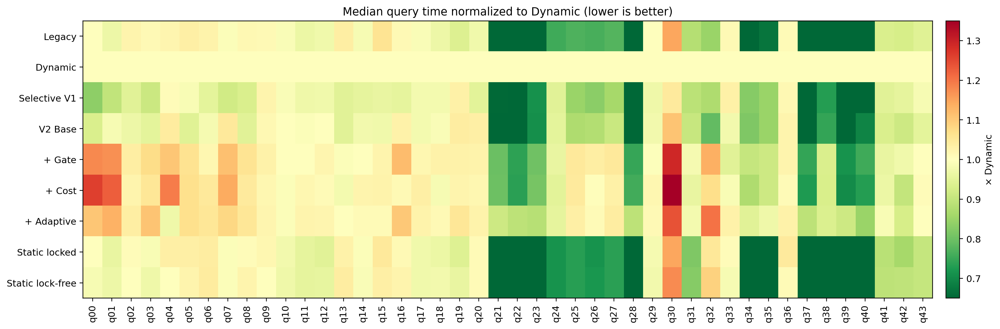
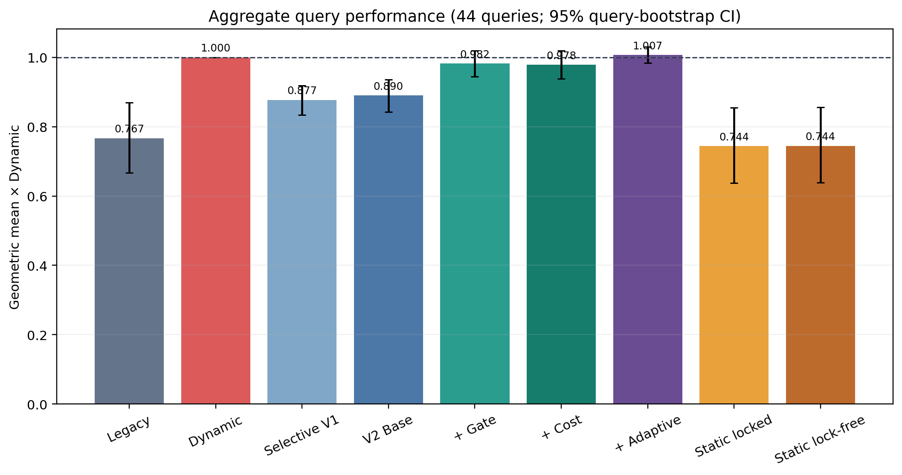
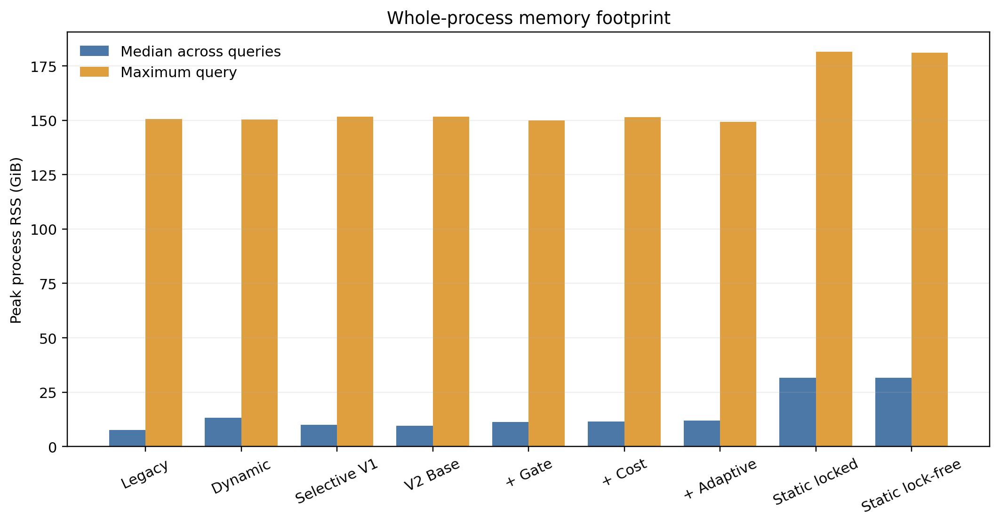
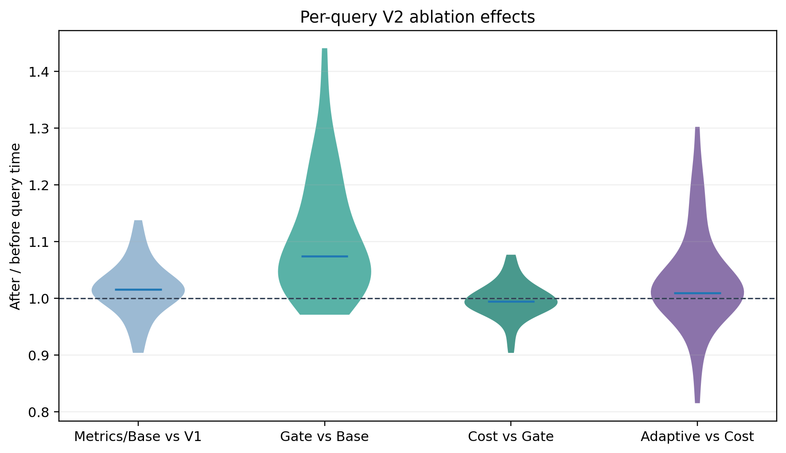
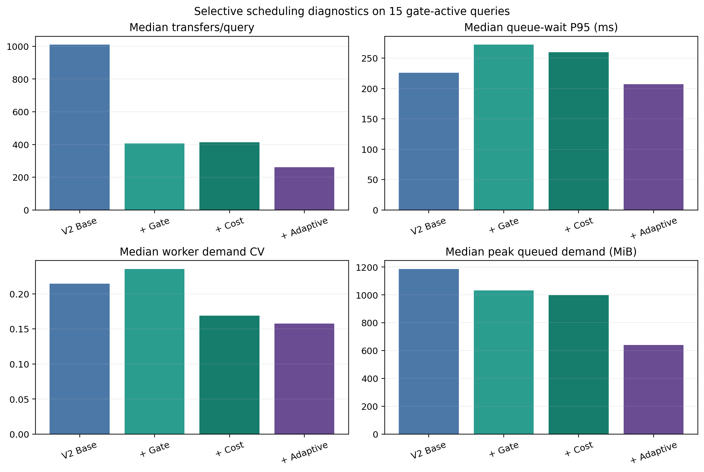
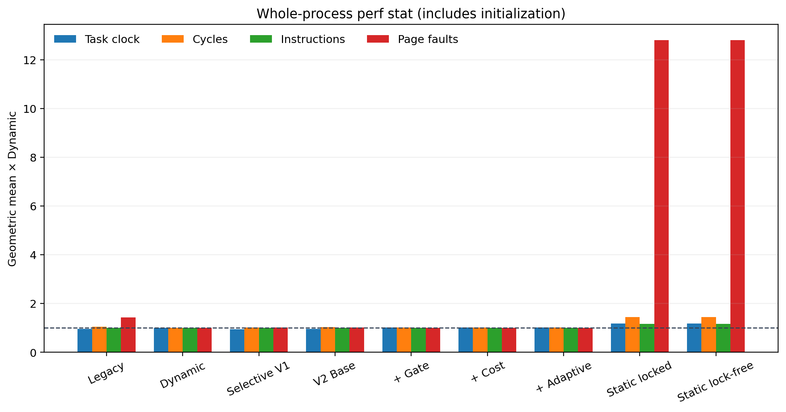
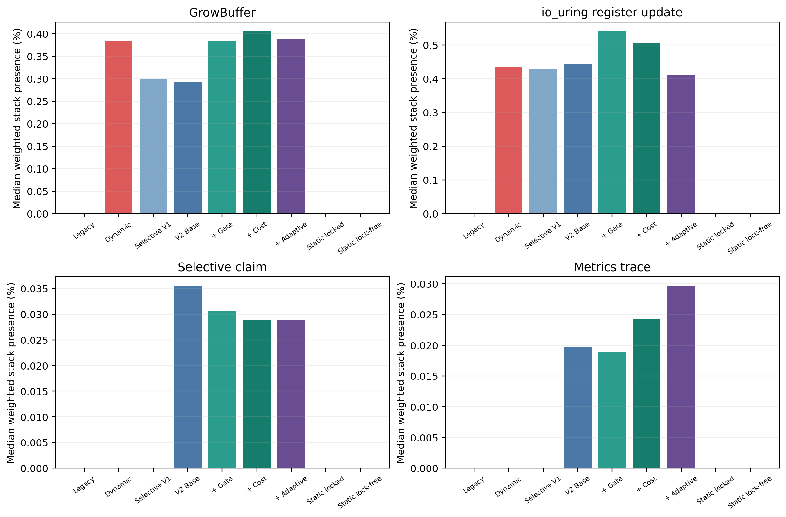

# Selective Growth V2 与 Static 无锁优化：16 SSD × 44 查询性能报告

日期：2026-09-14
实验完成时间：2026-09-13 17:36:11（Asia/Shanghai）

## 结论摘要

本轮实验完整覆盖 44 条 ClickBench 查询、9 种 Buffer 模式和 3 次 timed 重复，共 1,188 条
timed 记录；每个 query/mode 另有一组 `perf stat`、一组 `perf record` 和一张火焰图，共 396 组；
四种 metrics-on Selective 模式产生 880 对 event/worker CSV。所有产物均存在且非空。

主要结论如下。

1. **固定 queue=4 的 Selective V1 仍是当前最有效的 Dynamic 改进。** 相对 Dynamic，44 查询
   等权几何平均查询时间降低 12.25%，34 条查询至少快 2%，进程时间降低 10.6%，跨查询 RSS
   中位数从 13.16 GiB 降至 9.99 GiB（-24.1%）。
2. **V2 metrics 本身约有 1.43% 的几何平均开销。** `selective-base` 与 V1 策略相同，仅打开
   V2 指标；它仍比 Dynamic 快 10.99%，但不应直接替代 metrics-off 的生产性能数据。
3. **当前 growth-pressure gate 过于保守，验收失败。** 它将转移数从 23,393 降至 5,384
   （-77.0%），同时使增长次数从 15,123 增至 20,151（+33.3%）；相对 Base 查询时间
   几何平均增加 10.32%，35/44 条查询回退超过 2%。Gate 阻止了大量原本有价值的容量复用。
4. **成本模型改善了接收者质量，但收益尚未稳定反映到时间。** 在 15 条 gate-active 查询中，
   executed-byte CV 平均从 0.238 降至 0.190（-20.0%），11/15 条改善；P95 等待平均降低
   6.2%。但 `gate-cost` 相对 Gate 仅快 0.36%，9 胜、26 持平、9 负，属于接近噪声边界的结果。
5. **当前自适应队列方向错误。** 它相对 gate-cost 再减少 37.2% 的转移，并降低活跃查询的
   排队等待和峰值队列，但查询时间几何平均增加 2.90%；增长字节增加 7.4%，观测 Buffer 总量
   增加 4.9%。q39、q37、q22、q28 分别回退 30.2%、22.8%、21.2%、17.8%。这些正是最需要
   容量复用的查询，说明控制器把“队列少”错误地当成了目标。
6. **Static 查询快，但独立查询的端到端代价不可接受。** Static 查询阶段比 Dynamic 快约
   25.6%，也比 Legacy 快约 3%；但每个进程预分配约 30 GiB，使 whole-process 时间达到
   Dynamic 的 4.2 倍，跨查询 RSS 中位数为 31.54 GiB。它只适合池生命周期跨多个查询摊销的
   常驻进程，不适合本实验的一 query 一进程场景。
7. **移除 Static 热点锁没有可测收益。** lock-free/locked 查询时间几何平均比值为 1.0009；
   37/44 条位于 ±2% 内。两者的 mutex weighted-stack presence 中位数都约 0.05%，原锁不是热点。
8. **Legacy 仍是本场景最实用的默认基线。** 它相对 Dynamic 快 23.3%，whole-process 时间快
   19.1%，RSS 中位数仅 7.70 GiB。Static 查询阶段略快，但初始化与内存代价远高于 Legacy；
   所有当前 Selective 版本也尚未超过 Legacy 的综合表现。

因此，本轮代码不应把 Gate 或 Adaptive 默认打开。若目标是继续推进 Selective，应保留 V1
queue=4 作为性能基线，保留 Cost 作为候选模块，重新设计 Gate 和 Adaptive 的目标函数。

## 实验设计与数据完整性

实验参数：16 SSD、48 worker、q00–q43、每个模式 3 次 timed 独立进程。模式顺序使用固定随机
种子打乱；不 drop cache。`perf stat` 和 `perf record` 是与 timed 分离的完整进程运行，因此
perf 用于解释机制，不与 timed 秒数逐次配对。

| 产物 | 期望 | 实际 | 完整性 |
|---|---:|---:|---|
| timed summary | 1,188 | 1,188 | 无重复、时间/RSS 无空值 |
| COMPLETE | 1,188 | 1,188 | 完整 |
| perf stat | 396 | 396 | 全部非空 |
| perf.data | 396 | 396 | 全部非空 |
| flamegraph.svg | 396 | 396 | 全部非空 |
| metrics events | 880 | 880 | 全部非空 |
| metrics workers | 880 | 880 | 全部非空 |

原始输出路径因手工命令换行而包含换行和两个空格：

```text
/home/whz/test/pixels/cpp/testcase/\n  buffer-pool/results/selective-v2-16ssd-full-20260913-
```

这不影响 manifest、查询结果或分析，但自动化工具不应硬编码该字符串。本报告的复现命令使用
`SUCCESS` 自动发现目录。

统计口径：每个 query/mode 取 3 次查询时间中位数；聚合性能使用 44 个逐查询比值的等权几何
平均。95% CI 是对 44 条查询进行固定种子的 query bootstrap，反映工作负载构成不确定性，
不是仅有 3 次重复条件下的严格总体置信区间。“胜/平/负”以相对 Dynamic 的 ±2% 为边界。

## 总体性能





| 模式 | 查询时间和（s） | 查询 GM / Dynamic | 95% CI | 进程 GM / Dynamic | 胜/平/负 | 重复极差中位数 |
|---|---:|---:|---:|---:|---:|---:|
| Legacy | 281.19 | 0.767 | [0.667, 0.870] | 0.809 | 25/12/7 | 5.1% |
| Dynamic | 381.40 | 1.000 | [1.000, 1.000] | 1.000 | 0/44/0 | 4.9% |
| Selective V1 | 331.15 | 0.877 | [0.834, 0.919] | 0.894 | 34/6/4 | 4.3% |
| V2 Base | 330.06 | 0.890 | [0.842, 0.935] | 0.916 | 30/7/7 | 5.0% |
| + Gate | 354.62 | 0.982 | [0.944, 1.020] | 0.982 | 14/9/21 | 4.4% |
| + Cost | 354.60 | 0.978 | [0.938, 1.019] | 1.003 | 15/12/17 | 4.8% |
| + Adaptive | 372.88 | 1.007 | [0.984, 1.030] | 1.019 | 14/10/20 | 4.0% |
| Static locked | 274.56 | 0.744 | [0.638, 0.855] | 4.213 | 25/11/8 | 1.9% |
| Static lock-free | 273.84 | 0.744 | [0.638, 0.855] | 4.203 | 27/9/8 | 1.9% |

这里“查询时间”来自 `EXPLAIN ANALYZE Total Time`；“进程时间”包含扩展加载、Buffer 初始化和
退出清理。Static 的查询阶段很快，但 44 条逐 query 进程时间中位数之和约 1,207–1,210 秒，
Dynamic 为 489 秒。这正是 Static 初始化不能在单查询实验中忽略的原因。

Selective V1 的主要收益集中在增长密集查询：q39 -44.5%、q28 -41.2%、q22 -39.3%、
q37 -37.5%、q40 -34.8%、q21 -34.7%、q23 -29.0%。其主要风险是 q30 +4.6%、q19/q33
约 +3.2%。这说明按文件转移到已有足够 Buffer 的 worker，确实能减少注册 Buffer 的扩容热点。

## 内存表现



| 模式 | 跨查询 RSS 中位数（GiB） | P95（GiB） | 最大值（GiB） |
|---|---:|---:|---:|
| Legacy | 7.70 | 96.48 | 150.51 |
| Dynamic | 13.16 | 100.59 | 150.32 |
| Selective V1 | 9.99 | 97.94 | 151.75 |
| V2 Base | 9.67 | 97.61 | 151.69 |
| + Gate | 11.27 | 98.95 | 150.01 |
| + Cost | 11.48 | 99.09 | 151.48 |
| + Adaptive | 12.03 | 99.78 | 149.26 |
| Static locked | 31.53 | 120.72 | 181.45 |
| Static lock-free | 31.54 | 120.79 | 181.18 |

最高 RSS 并非都来自 Buffer Pool。q33 在所有非 Static 模式约 149–152 GiB，Static 约 181 GiB；
这是查询算子内存叠加约 30 GiB Static 预分配的表现。q34/q35 同样有约 100 GiB 的查询侧内存。
因此峰值 RSS 不能直接解释为 Buffer 容量，必须结合 `observed_buffer_bytes`。

在 Selective 模式中，V1/Base 的 44 查询观测 Buffer 总量约 98.0 GiB。Gate 基本没有进一步
降低它；Adaptive 反而升至 102.76 GiB。对高内存 q24：Dynamic RSS 41.50 GiB，V1/Base
约 37.7 GiB，Gate/Cost/Adaptive 约 37.9–38.9 GiB，Legacy 31.44 GiB，Static 31.5 GiB。
q24 的查询计算占比高，因此即使包含字符串列和 5,900–6,700 次增长，Selective 各版本时间仍
集中在 37.9–38.5 秒，没有像 q21/q22/q37/q39 那样出现巨幅相对差异。

## V2 消融分析



| 阶段 | 查询时间 GM（after/before） | >2% 改善 | ±2% | >2% 回退 | 判断 |
|---|---:|---:|---:|---:|---|
| Metrics/Base vs V1 | 1.014 | 7 | 18 | 19 | 指标约 1.4% 开销 |
| Gate vs Base | 1.103 | 1 | 8 | 35 | 明确失败 |
| Cost vs Gate | 0.996 | 9 | 26 | 9 | 负载改善、时间近中性 |
| Adaptive vs Cost | 1.029 | 5 | 21 | 18 | 当前策略失败 |
| Static lock-free vs locked | 1.001 | 4 | 37 | 3 | 无显著收益 |

### Growth-pressure gate

| 指标（44 查询中位数求和） | Base | Gate | 变化 |
|---|---:|---:|---:|
| transferred files | 23,393 | 5,384 | -77.0% |
| growth count | 15,123 | 20,151 | +33.3% |
| growth bytes | 65.84 GiB | 66.43 GiB | +0.9% |
| observed Buffer | 97.94 GiB | 97.89 GiB | -0.1% |

Gate 成功消除了 q00/q30/q42 等无真实增长查询的无效转移，但收益不足以抵消其副作用。当前
`require_history=true` 要求同一列已经发生过增长后才能转移，导致许多 worker 先独立增长；
`min_bytes=4 MiB` 又忽略了多个中小增长累积的注册成本。结果是 transferred 数看似更漂亮，
实际增长次数和查询时间更差。

短查询的拒绝路径本身也不可忽略：q30 无增长，V1 为 Dynamic 的 1.046 倍，Base 为 1.108 倍，
Gate 为 1.292 倍。火焰图能看到 `SelectiveBufferScheduler::claim`、`clock_gettime` 和 trace 路径；
它们单项占比不高，但在 10,240 个文件的短查询上累积后可测。

### 接收者成本模型

Gate 仅在 15/44 条查询发生转移。在这 15 条中：

- executed-byte CV 平均值：0.238 → 0.190（-20.0%）；
- CV 改善查询：11/15；
- P95 queue wait 平均值：443.5 ms → 416.0 ms（-6.2%）；
- 峰值 queued demand 平均值：1,075 MiB → 1,016 MiB（-5.5%）；
- 查询时间几何平均只改善 0.36%。

成本模型本身方向正确，但 Gate 已将候选和转移数大幅压缩，尤其 q25/q27 几乎没有转移，导致
Cost 无法在原计划中的关键查询发挥作用。下一轮必须增加 `selective-cost`（Base+Cost、无 Gate）
全量消融，才能区分“成本模型无效”和“被 Gate 限制后样本不足”。

### 自适应队列



图中只统计 15 条 gate-active 查询，避免另外 29 条零转移查询把中位数压成零。相对 Cost：

- transfers：5,426 → 3,405（-37.2%）；
- P95 wait 中位数：259.7 ms → 207.0 ms（-20.3%）；
- 峰值 queued demand 平均值：1,016 MiB → 775 MiB（-23.7%）；
- growth bytes：66.27 GiB → 71.19 GiB（+7.4%）；
- observed Buffer：98.00 GiB → 102.76 GiB（+4.9%）；
- 查询时间：+2.90%。

共记录约 4,090 次 adaptive-limit change。控制器确实降低了队列，但频繁收紧使增长密集查询
失去跨 worker 复用机会。队列长度不是应被最小化的目标；目标应是
`avoided_growth_cost - queue_wait_cost - locality_cost`。

## 代表性查询

下表是查询时间中位数，单位为秒。

| Query | Legacy | Dynamic | V1 | Base | Gate | Cost | Adaptive | Static LF |
|---|---:|---:|---:|---:|---:|---:|---:|---:|
| q21 | 3.59 | 11.91 | 7.78 | 7.66 | 9.48 | 9.52 | 10.90 | 3.24 |
| q22 | 3.24 | 11.75 | 7.13 | 7.29 | 8.69 | 8.65 | 10.48 | 2.76 |
| q23 | 5.44 | 15.19 | 10.79 | 10.75 | 12.18 | 12.31 | 13.42 | 4.81 |
| q24 | 30.23 | 40.03 | 37.88 | 38.14 | 38.47 | 38.03 | 38.24 | 28.59 |
| q25 | 1.74 | 2.26 | 1.92 | 1.97 | 2.37 | 2.36 | 2.34 | 1.66 |
| q27 | 1.79 | 2.31 | 1.99 | 2.10 | 2.42 | 2.38 | 2.40 | 1.70 |
| q28 | 3.12 | 12.04 | 7.08 | 6.63 | 9.01 | 9.11 | 10.73 | 2.82 |
| q30 | 1.49 | 1.30 | 1.36 | 1.44 | 1.68 | 1.76 | 1.61 | 1.53 |
| q34 | 17.77 | 30.74 | 25.44 | 25.11 | 27.79 | 26.80 | 29.07 | 18.58 |
| q35 | 19.73 | 29.48 | 25.00 | 25.01 | 26.94 | 26.93 | 28.61 | 17.85 |
| q37 | 2.99 | 11.42 | 7.14 | 6.49 | 8.50 | 8.29 | 10.18 | 2.58 |
| q39 | 3.01 | 11.08 | 6.15 | 6.37 | 7.92 | 7.78 | 10.13 | 2.61 |
| q40 | 4.76 | 13.61 | 8.88 | 9.43 | 10.29 | 9.94 | 11.54 | 4.22 |
| q42 | 1.40 | 1.51 | 1.44 | 1.38 | 1.47 | 1.36 | 1.40 | 1.35 |

q21/q22/q23/q28/q37/q39/q40 形成一致证据：V1/Base 的较积极转移能明显缓解 GrowBuffer，Gate
保留部分收益，Adaptive 又接近 Dynamic。q25/q27 表明 Gate 过严后转移几乎归零，性能回到甚至
略差于 Dynamic。q30 则证明零增长查询需要完全绕过 Selective 热路径，而不仅是最后拒绝转移。

每个重点查询和 V2 模式的 worker Buffer、queued demand、等待 ECDF 与 worker load 四联图位于
[`figures/selective-v2-16ssd-results/`](figures/selective-v2-16ssd-results/)。例如：

- [q21 Base](figures/selective-v2-16ssd-results/q21-selective-base-r0-telemetry.png)
- [q21 Cost](figures/selective-v2-16ssd-results/q21-selective-gate-cost-r0-telemetry.png)
- [q24 Adaptive](figures/selective-v2-16ssd-results/q24-selective-all-r0-telemetry.png)
- [q39 Adaptive](figures/selective-v2-16ssd-results/q39-selective-all-r0-telemetry.png)

## perf 与火焰图解释



| 模式 | task-clock / Dynamic | cycles / Dynamic | instructions / Dynamic | faults / Dynamic |
|---|---:|---:|---:|---:|
| Legacy | 0.962 | 1.047 | 0.997 | 1.435 |
| Selective V1 | 0.939 | 1.014 | 0.999 | 1.011 |
| V2 Base | 0.964 | 1.034 | 1.003 | 1.015 |
| Gate | 1.011 | 1.018 | 1.004 | 0.998 |
| Cost | 1.013 | 1.015 | 1.003 | 1.003 |
| Adaptive | 1.022 | 1.014 | 1.004 | 1.004 |
| Static locked | 1.179 | 1.448 | 1.171 | 12.803 |
| Static lock-free | 1.181 | 1.450 | 1.171 | 12.803 |

这是 whole-process perf，Static 的初始化和 30 GiB 预触碰导致 faults 约为 Dynamic 的 12.8 倍，
也解释了其查询阶段快、端到端慢的矛盾。V1 的 instructions 基本不变而 task-clock 下降，收益更
符合“减少扩容注册及等待”而非“少执行大量用户态指令”。



在增长密集查询中，包含 `DynamicBufferPool::GrowBuffer` 的 weighted-stack presence 如下：

| Query | Dynamic | V1 | Base | Gate | Cost | Adaptive |
|---|---:|---:|---:|---:|---:|---:|
| q21 | 6.3% | 3.9% | 3.9% | 5.2% | 5.3% | 6.0% |
| q22 | 8.2% | 5.0% | 5.2% | 6.7% | 6.5% | 7.3% |
| q28 | 8.5% | 5.1% | 4.9% | 5.9% | 6.3% | 7.7% |
| q37 | 19.2% | 11.4% | 11.6% | 14.1% | 13.5% | 16.2% |
| q39 | 20.6% | 11.1% | 12.5% | 14.8% | 15.3% | 18.6% |
| q40 | 14.9% | 9.9% | 9.4% | 11.1% | 11.5% | 12.5% |

热点回升顺序与性能回退一致，为 Gate/Adaptive 的因果解释提供了独立证据。所有模式的 folded
stack 中 `[unknown]` 权重很高（中位数约 84%–90%），绝对热点百分比应谨慎解释，但同一构建、
同一采样方法下的模式对比仍有价值。下一轮应保留 frame pointer，并补充符号解析检查。

Static locked 与 lock-free 的 `GlobalStaticBufferPool::GetBuffer` stack presence 都约 0.02%，
mutex presence 都约 0.05%。查询端 `poolMutex_` 不是当前瓶颈；Static 的主要问题是生命周期和
预分配成本。

## 下一轮改进建议

### P0：恢复可靠基线

1. 生产候选保持 `selective-4`、metrics off；Gate/Adaptive 默认关闭。
2. 增加真正正交的 `selective-cost` 和 `selective-adaptive` 全量模式，不能只测试 Gate 条件下的
   Cost/Adaptive。
3. 对“首次 metadata 即可判断整列/整文件都不可能增长”的查询设置 fast bypass，使 q00/q30
   完全不进入 claim、计时和 trace 热路径。

### P1：重新设计 Gate

1. 将 bool gate 改成收益阈值：
   `expected_register_ns_saved > predicted_queue_wait_ns + routing_overhead_ns`。
2. 不再要求同一列必须已有增长历史；用 metadata demand、当前容量差、列历史 P50/P95 和一次
   注册扩容成本预测“即将增长”。
3. 以累计避免增长字节/注册次数为门槛，而不是固定 `4 MiB` 单次阈值。
4. 对 q25/q27 这类中小 Buffer、频繁增长查询保留转移通道。

### P1：保留并加强 Cost

1. 在 Base+Cost（无 Gate）上验证是否仍能降低 CV，并测量 storage/NUMA 跨域惩罚。
2. 成本中直接加入预测等待时间，而不只用 queue depth/bytes；对大文件使用 service-time 加权。
3. 给 receiver 设置 reserved-capacity 或并发槽，避免容量最大的 worker 成为热点。

### P1：重做 Adaptive

1. 控制目标从“降低队列”改成最小化增长注册时间与排队时间之和。
2. 增加 hysteresis、最小驻留窗口和每 N 个文件最多调整一次，减少约 4,090 次 limit 变化。
3. 高增长压力下不能因为短时队列上涨立即收紧；q21/q22/q28/q37/q39/q40 应维持 2–4。
4. 同时输入 `growth rate`、`register latency`、`queue wait` 和 `receiver idle time`，而非只依赖
   growth-pressure EWMA。

### P2：Static

1. 暂不继续优化 `GetBuffer()` 锁；lock-free 默认仍关闭，或仅作为无回归清理保留。
2. 若要证明 Static 的系统价值，改用一个常驻 DuckDB 进程连续执行完整 query suite，将一次
   预分配摊销到多查询，再报告 steady-state time、startup time 和 steady-state RSS。
3. 研究按查询列集合惰性初始化 Static pool，避免所有 105 列 × 48 worker × 双 Buffer 全量预分配。

## 可复现分析

```bash
RESULT_FILE=$(find testcase -type f \
  -path '*selective-v2-16ssd-full-20260913-*/SUCCESS' -print -quit)
RESULT_DIR=${RESULT_FILE%/SUCCESS}
OUT=docs/buffer-pool/figures/selective-v2-16ssd-results

MPLCONFIGDIR=/tmp/pixels-matplotlib \
python3 testcase/buffer-pool/plot_selective_v2_metrics.py \
  --results "$RESULT_DIR" --output "$OUT" \
  --modes selective-base selective-gate selective-gate-cost selective-all

MPLCONFIGDIR=/tmp/pixels-matplotlib \
python3 testcase/buffer-pool/analyze_selective_v2_full.py \
  --results "$RESULT_DIR" \
  --metrics-summary "$OUT/selective-v2-metrics-summary.csv" \
  --output "$OUT"
```

机器可读表格：

- [逐查询与模式](figures/selective-v2-16ssd-results/per-query-mode-summary.csv)
- [模式聚合](figures/selective-v2-16ssd-results/aggregate-mode-summary.csv)
- [消融逐查询差值](figures/selective-v2-16ssd-results/ablation-query-deltas.csv)
- [Selective 策略指标](figures/selective-v2-16ssd-results/selective-policy-summary.csv)
- [perf 聚合](figures/selective-v2-16ssd-results/perf-mode-summary.csv)
- [火焰图热点](figures/selective-v2-16ssd-results/flamegraph-hotspots.csv)
